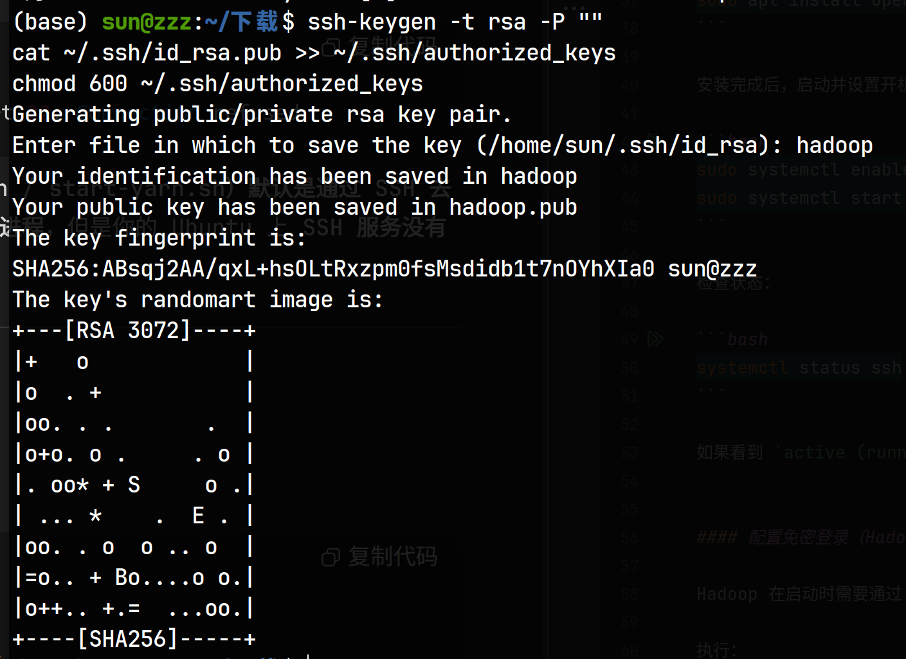

# 环境配置
- ubuntu 24.04
- hadoop-3.3.0
- hbase-2.4.18
- jdk 1.8.0_461
- zookeeper-3.7.2
---
## 安装 JDK
### 解压
在已经下载好`jdk-8u461-linux-x64.tar.gz`的目录下打开终端。
把jdk的文件解压到`/usr/local/java`目录下
```bash
sudo mkdir -p /usr/local/java
sudo tar -zxvf jdk-8u461-linux-x64.tar.gz -C /usr/local/java
```


### 配置环境变量
在`~/.bashrc`配置文件中修改java的配置：
```bash
export JAVA_HOME=/usr/local/java/jdk1.8.0_461
export PATH=$JAVA_HOME/bin:$PATH
```
刷新环境：
```bash
source ~/.bashrc
java -version
# 预期输出 java version "1.8.0_461"
```
---
## 配置SSH
### 安装并启动SSH服务
在终端执行：
```bash
sudo apt update
sudo apt install openssh-server -y
```

安装完成后，启动并设置开机自启：

```bash
sudo systemctl enable ssh
sudo systemctl start ssh
```

检查状态：

```bash
systemctl status ssh
```

如果看到 `active (running)` 就说明 SSH 已经正常运行。


#### 配置免密登录（Hadoop 启动脚本需要）

Hadoop 在启动时需要通过 SSH 登录 **本机的 localhost**，所以要配置免密。

执行：

```bash
ssh-keygen -t rsa -P ""
cat ~/.ssh/id_rsa.pub >> ~/.ssh/authorized_keys
chmod 600 ~/.ssh/authorized_keys
```
然后给这个key起名

测试是否能无密码登录：

```bash
ssh localhost
```

能直接进去而不需要输入密码，就说明免密登录配置好了，输入 `exit` 退出。

---

## 安装 Haddoop 3.3.0
### 下载&解压
在已经下载好`hadoop-3.3.0.tar.gz`的目录下运行：
````bash
tar -zxvf hadoop-3.3.0.tar.gz
sudo mv hadoop-3.3.0 /usr/local/hadoop
````

### 配置环境变量

在 `~/.bashrc` 添加：

```bash
export HADOOP_HOME=/usr/local/hadoop
export PATH=$HADOOP_HOME/bin:$HADOOP_HOME/sbin:$PATH
```

刷新：

```bash
source ~/.bashrc
hadoop version
# 可以看到Hadoop 3.3.0就说明成功了
```

### 修改配置文件

在 `$HADOOP_HOME/etc/hadoop` 下修改对应的文件：
(按照前面的流程做的是在`/usr/local/hadoop/etc/hadoop`下)
#### hadoop-env.sh
直接添加一行即可
```bash
export JAVA_HOME=/usr/local/java/jdk1.8.0_461
```

#### core-site.xml
修改原来的`<configuration></configuration>`为
因为现在是在本地模拟分布，所以使用localhost为ip地址。

作用：配置Hadoop核心参数

关键配置：

`fs.defaultFS`：定义默认文件系统为HDFS，地址是hdfs://localhost:9000

`hadoop.tmp.dir`：指定Hadoop运行时的临时目录
```xml
<configuration>
    <property>
        <name>fs.defaultFS</name>
        <value>hdfs://localhost:9000</value>
    </property>
    <property>
        <name>hadoop.tmp.dir</name>
        <value>/usr/local/hadoop/tmp</value>
    </property>
</configuration>
```

#### hdfs-site.xml
修改原来的`<configuration></configuration>`

作用：配置HDFS（Hadoop分布式文件系统）相关参数

关键配置：

dfs.replication：设置数据副本数为1（单机伪分布式）

dfs.namenode.name.dir：NameNode元数据存储位置 

dfs.datanode.data.dir：DataNode数据存储位置

```xml
<configuration>
    <property>
        <name>dfs.replication</name>
        <value>1</value>
    </property>
    <property>
        <name>dfs.namenode.name.dir</name>
        <value>file:///usr/local/hadoop/hdfs/namenode</value>
    </property>
    <property>
        <name>dfs.datanode.data.dir</name>
        <value>file:///usr/local/hadoop/hdfs/datanode</value>
    </property>
</configuration>
```

#### mapred-site.xml
修改原来的`<configuration></configuration>`

```xml
<configuration>
    <property>
        <name>mapreduce.framework.name</name>
        <value>yarn</value>
    </property>
</configuration>

```

#### yarn-site.xml
修改原来的`<configuration></configuration>`为
```xml
<configuration>
    <property>
        <name>yarn.nodemanager.aux-services</name>
        <value>mapreduce_shuffle</value>
    </property>
    <property>
        <name>yarn.resourcemanager.hostname</name>
        <value>localhost</value>
    </property>
</configuration>

```

### 启动 Hadoop

```bash
hdfs namenode -format  # 这句是用于初始化NameNode的，在第一次启动前进行格式化。
start-dfs.sh
start-yarn.sh
```

检查当前启动的：

```bash
jps
# 应该看到 NameNode、DataNode、SecondaryNameNode、ResourceManager、NodeManager
```
可以通过下面的命令来停止之前的进程
````bash
stop-dfs.sh
stop-yarn.sh
````

Web UI：

* NameNode: [http://localhost:9870](http://localhost:9870)
* YARN: [http://localhost:8088](http://localhost:8088)

---

## 安装 ZooKeeper 3.7.1

HBase 依赖 ZooKeeper。

### 下载 & 解压
下载`apache-zookeeper-3.7.2-bin.tar.gz`压缩包，在文件所在目录运行：
```bash
tar -zxvf apache-zookeeper-3.7.2-bin.tar.gz
sudo mv apache-zookeeper-3.7.2-bin /usr/local/zookeeper
```

## 配置

复制默认配置：

```bash
cd /usr/local/zookeeper/conf
cp zoo_sample.cfg zoo.cfg
```

编辑 `zoo.cfg`：
可以直接全部替换，或者找到对应项来替换：
```ini
tickTime=2000
dataDir=/usr/local/zookeeper/data
dataLogDir=/usr/local/zookeeper/logs
clientPort=2181
initLimit=10
syncLimit=5
```

创建目录：

```bash
sudo mkdir -p /usr/local/zookeeper/data
sudo mkdir -p /usr/local/zookeeper/logs
```

## 启动 ZooKeeper
添加环境变量，编辑 `~/.bashrc`：
````bash
export ZOOKEEPER_HOME=/usr/local/zookeeper
export PATH=$PATH:$ZOOKEEPER_HOME/bin
````
刷新
```bash
source ~/.bashrc
```


```bash
zkServer.sh start   # 运行
zkServer.sh status  # 查看状态
zkServer.sh stop   # 运行
```
如果看到 `Mode: standalone`，说明启动成功。
再用 `jps`，应该看到 `QuorumPeerMain` 进程。
---

## 安装 HBase

### 下载 & 解压
解压`hbase-2.4.18-bin.tar.gz`并移动
```bash
tar -zxvf hbase-2.4.18-bin.tar.gz
sudo mv hbase-2.4.18 /usr/local/hbase
```

### 配置环境变量

在 `~/.bashrc` 添加：

```bash
export HBASE_HOME=/usr/local/hbase
export PATH=$HBASE_HOME/bin:$PATH
```

刷新：

```bash
source ~/.bashrc
```

### 修改配置文件

在 `$HBASE_HOME/conf` 下：
（/usr/local/hbase/conf）
#### hbase-env.sh
添加语句
```bash
export JAVA_HOME=/usr/local/java/jdk1.8.0_461
export HBASE_MANAGES_ZK=false   # 因为我们自己启动了独立的 ZooKeeper
```

#### hbase-site.xml

```xml
<configuration>
    <!-- 使用 HDFS 存储 HBase 数据 -->
    <property>
        <name>hbase.rootdir</name>
        <value>hdfs://localhost:9000/hbase</value>
    </property>

    <!-- 表示这是一个分布式集群（即便是伪分布式） -->
    <property>
        <name>hbase.cluster.distributed</name>
        <value>true</value>
    </property>

    <!-- ZooKeeper 配置 -->
    <property>
        <name>hbase.zookeeper.quorum</name>
        <value>localhost</value>
    </property>
    <property>
        <name>hbase.zookeeper.property.clientPort</name>
        <value>2181</value>
    </property>
</configuration>
```

### 启动 HBase

```bash
start-hbase.sh
```

验证：

```bash
jps
# 多了 HMaster、HRegionServer
```

Web UI：

* HBase Master: [http://localhost:16010](http://localhost:16010)

---

## 启动顺序总结

1. 启动 Hadoop（HDFS + YARN）

```bash
start-dfs.sh
start-yarn.sh
```
* NameNode: [http://localhost:9870](http://localhost:9870)
* YARN: [http://localhost:8088](http://localhost:8088)

2. 启动 ZooKeeper

```bash
zkServer.sh start
```
3. 启动 HBase

```bash
start-hbase.sh
```

* HBase Master: [http://localhost:16010](http://localhost:16010)
---

---


