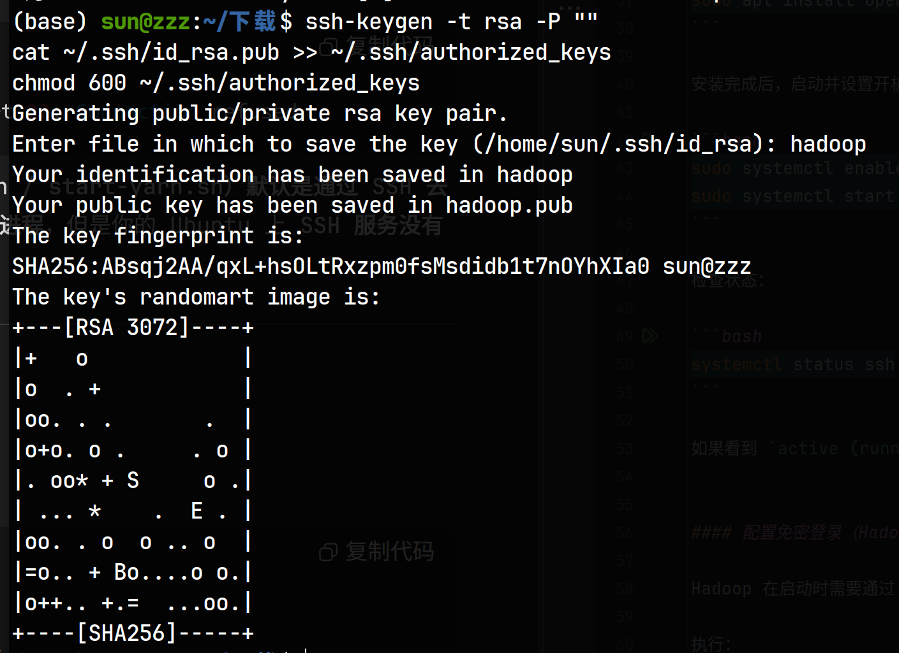

# Hadoop生态

---

## Hadoop

* **是什么** ：一个大数据处理的框架/生态系统，不是单一软件。
* **作用** ：提供大数据的存储、计算、管理能力。
* **核心模块** ：

1. **HDFS** → 分布式存储
2. **YARN** → 资源调度/作业管理
3. **MapReduce** → 分布式计算框架
4. **（外加 HBase、Hive、Spark 等扩展组件）**

可以理解为： **Hadoop = 一整套分布式大数据操作系统** 。

---

## HDFS (Hadoop Distributed File System)

* **是什么** ：Hadoop 的分布式文件系统。
* **作用** ：把很多台机器的磁盘组合在一起，当作一个“超级大硬盘”来存放数据。
* **特点** ：
* 文件会被切分成数据块（通常 128MB 一块），分散存储在不同机器上。
* 有副本机制（默认 3 份），保证数据不丢失。
* **比喻** ：像把一个大文件柜切分成很多抽屉，放到不同的房间，钥匙（NameNode）知道每个抽屉在哪。

**HDFS中有NameNode和DataNode:**

**NameNode**

* **是什么**：HDFS 的“大脑”，文件系统的管理者。
* **作用**：

  * 负责存储文件的元数据（比如 `/user/data/file1.txt` 存在哪些 DataNode、文件大小、权限等信息）。
  * 不存储文件内容，只存储目录树和块映射信息。
  * 客户端要访问 HDFS 的文件时，先找 NameNode。
* **举例**：你往 HDFS 上传一个 128MB 的文件 → NameNode 记录：这个文件被切成 2 个块，分别存储在哪些 DataNode 上。

**DataNode**

* **是什么**：HDFS 的“工人”，存储实际的数据块。
* **作用**：

  * 存储文件块（block），定期向 NameNode 汇报健康状态和存储块信息。
  * 负责读写数据（客户端直接和 DataNode 交互，而不是 NameNode）。
* **举例**：当你写文件到 HDFS 时，数据最终是写到 DataNode 磁盘上。

## MapReduce

* **是什么** ：Hadoop 提供的  **分布式计算模型** 。
* **作用** ：用来在集群里并行处理大规模数据。
* **运行流程** ：

1. **Map** ：把任务分成小块，分发给多个节点（例如：每个节点统计自己那部分单词词频）。
2. **Reduce** ：把各个节点的结果汇总（例如：合并所有节点的词频，得到全局统计）。

* **比喻** ：像老师布置作业，把试卷分给很多学生（Map），最后收回来汇总成绩（Reduce）。

---

## YARN (Yet Another Resource Negotiator)

* **是什么** ：Hadoop 的  **资源管理与作业调度框架** 。
* **作用** ：决定  **哪个任务在哪台机器上跑** ，以及如何分配 CPU/内存等资源。
* **核心角色** ：
* **ResourceManager**

  * **是什么**：**整个集群**的“资源总管”。
  * **作用**：

    * 管理集群的计算资源（CPU、内存等）。
    * 调度任务：比如你提交一个 MapReduce 作业，ResourceManager 会决定在哪些节点启动对应的任务。
* **NodeManager**

  * **是什么**：每个**工作节点**上的“资源代理”。
  * **作用**：

    * 向 ResourceManager 汇报本机的资源情况（多少内存、多少 CPU 可用）。
    * 负责启动和监控在本节点上运行的任务（容器）。
  * **关系**：NodeManager 就像一个“分公司经理”，听 ResourceManager 的调度安排。

---

## HBase

* **是什么** ：基于 HDFS 构建的  **分布式 NoSQL 数据库** 。
* **作用** ：用来存储  **大规模结构化数据** ，支持快速的随机读写（不像 HDFS 只能顺序读写）。
* **特点** ：
* 数据模型是  **表 → 行键(RowKey) → 列族 → 列 → 值** 。
* 可以存储数十亿行、数百万列的大表。
* **比喻** ：HDFS 像一个“大仓库”（文件系统），但仓库只能顺序翻找；HBase 在仓库上面加了一层“索引系统”，让你可以像查字典一样快速定位某一行某一列。

---

## ZooKeeper

在 Hadoop 生态里， **HDFS + YARN 本身就能跑起来** ，但一旦引入  **HBase** ，就必须有 **ZooKeeper** 才能正常工作。

---

* ZooKeeper 是一个  **分布式协调服务** 。
* 它自己并不是数据库、存储或计算引擎，而是一个  **管理集群的“调度员/管理员”** 。
* 可以用来：

  1. 管理  **分布式应用的配置** （例如谁是主节点）。
  2. 提供  **命名服务** （给节点/服务取名字）。
  3. 提供  **分布式锁** （保证多个客户端操作的顺序和互斥）。
  4. 监控节点状态（心跳检测，宕机感知）。

---

### 为什么 HBase 需要 ZooKeeper？

HBase 是一个  **分布式数据库** ，它有：

* **HMaster** （负责管理表的元数据、分配 RegionServer）。
* **HRegionServer** （真正存储数据，处理读写请求）。

问题来了：

* 如果有多个 HMaster，谁来决定  **哪个是“主 HMaster”** ？
* 如果某个 RegionServer 挂掉了，谁来通知 HMaster ？
* 客户端如何快速找到自己要访问的 RegionServer？

 这些协调、选主、状态检测的事情，就交给了  **ZooKeeper** 。

---

在配置的伪分布式环境时

* 单独启动了 ZooKeeper（`zkServer.sh start`）。
* HBase 配置里写了：

  ```xml
  <property>
      <name>hbase.zookeeper.quorum</name>
      <value>localhost</value>
  </property>
  <property>
      <name>hbase.zookeeper.property.clientPort</name>
      <value>2181</value>
  </property>
  ```

  意味着：

  * **HBase Master、RegionServer、客户端** 都会去找 `localhost:2181` 这个 ZooKeeper，来完成“谁是主 HMaster、RegionServer 状态、客户端路由”等协调功能。

---

## 关系总结（一句话版）

* **Hadoop** = 整个生态系统
* **HDFS** = 存储层（存大文件）
* **MapReduce** = 计算层（怎么处理数据）
* **YARN** = 资源调度层（让任务跑起来）
* **HBase** = 数据库（在 HDFS 上建表，快速查改数据）

---

要不要我给你画一张  **整体架构图** （HDFS + YARN + MapReduce + HBase）？这样你能更直观地看到它们之间的关系。

# 分布方式比较

---

## 单机模式（Standalone Mode）

* **特点** ：
* 默认安装 Hadoop 后就是单机模式。
* 所有进程都运行在一个 JVM 里，没有 HDFS，没有 YARN。
* 数据存在本地文件系统（ext4/xfs 等）。
* **用途** ：
* 测试最基本的功能（例如写个 MapReduce 逻辑跑一下）。
* 不涉及真正的分布式存储或计算。

## 伪分布式（Pseudo-distributed Mode）

* **特点** ：
* 所有 Hadoop 组件（NameNode、DataNode、ResourceManager、NodeManager 等）都跑在 **一台机器** 上。
* 进程之间还是通过网络（localhost）通信，模拟集群环境。
* 数据存储在本机磁盘上，但逻辑上仍然使用 HDFS 的块、副本机制。
* **用途** ：
* 学习/开发阶段常用，可以在本地模拟完整的 Hadoop 运行环境。
* 方便理解  **进程之间的关系** ，练习 HDFS + YARN + HBase 的启动与使用。

---

## 完全分布式（Fully-distributed Mode）

* **特点** ：
* Hadoop 部署在 **多台机器** 上（通常是几十到上千台）。
* NameNode 负责全局元数据，DataNode 分布在各台机器上。
* 任务由 ResourceManager 调度到不同机器上的 NodeManager 执行。
* 具备真正的分布式存储和并行计算能力。
* **用途** ：
* 生产环境下使用，存储 TB/PB 级数据，支撑海量计算任务。

---

## 总结对比表

| 模式       | 部署规模 | 进程分布 | 存储方式           | 使用场景             |
| ---------- | -------- | -------- | ------------------ | -------------------- |
| 单机模式   | 1 台机器 | 单进程   | 本地文件系统       | 最简单的功能测试     |
| 伪分布式   | 1 台机器 | 多进程   | HDFS（存本地盘）   | 学习、实验、开发     |
| 完全分布式 | 多台机器 | 多进程   | HDFS（跨机器存储） | 生产环境、大数据处理 |

---

# 环境配置

这个板块实现的伪分布

- ubuntu 24.04
- hadoop-3.3.0
- hbase-2.4.18
- jdk 1.8.0_461
- zookeeper-3.7.2

---

## 安装 JDK

### 解压

在已经下载好 `jdk-8u461-linux-x64.tar.gz`的目录下打开终端。
把jdk的文件解压到 `/usr/local/java`目录下

```bash
sudo mkdir -p /usr/local/java
sudo tar -zxvf jdk-8u461-linux-x64.tar.gz -C /usr/local/java
```

### 配置环境变量

在 `~/.bashrc`配置文件中修改java的配置：

```bash
export JAVA_HOME=/usr/local/java/jdk1.8.0_461
export PATH=$JAVA_HOME/bin:$PATH
```

刷新环境：

```bash
source ~/.bashrc
java -version
# 预期输出 java version "1.8.0_461"
```

---

## 配置SSH

### 安装并启动SSH服务

在终端执行：

```bash
sudo apt update
sudo apt install openssh-server -y
```

安装完成后，启动并设置开机自启：

```bash
sudo systemctl enable ssh
sudo systemctl start ssh
```

检查状态：

```bash
systemctl status ssh
```

如果看到 `active (running)` 就说明 SSH 已经正常运行。

#### 配置免密登录（Hadoop 启动脚本需要）

Hadoop 在启动时需要通过 SSH 登录 **本机的 localhost**，所以要配置免密。

执行：

```bash
ssh-keygen -t rsa -P ""
cat ~/.ssh/id_rsa.pub >> ~/.ssh/authorized_keys
chmod 600 ~/.ssh/authorized_keys
```

然后给这个key起名

测试是否能无密码登录：

```bash
ssh localhost
```

能直接进去而不需要输入密码，就说明免密登录配置好了，输入 `exit` 退出。

---

## 安装 Haddoop 3.3.0

### 下载&解压

在已经下载好 `hadoop-3.3.0.tar.gz`的目录下运行：

````bash
tar -zxvf hadoop-3.3.0.tar.gz
sudo mv hadoop-3.3.0 /usr/local/hadoop
````

### 配置环境变量

在 `~/.bashrc` 添加：

```bash
export HADOOP_HOME=/usr/local/hadoop
export PATH=$HADOOP_HOME/bin:$HADOOP_HOME/sbin:$PATH
```

刷新：

```bash
source ~/.bashrc
hadoop version
# 可以看到Hadoop 3.3.0就说明成功了
```

### 修改配置文件

在 `$HADOOP_HOME/etc/hadoop` 下修改对应的文件：
(按照前面的流程做的是在 `/usr/local/hadoop/etc/hadoop`下)

#### hadoop-env.sh

直接添加一行即可

```bash
export JAVA_HOME=/usr/local/java/jdk1.8.0_461
```

#### core-site.xml

修改原来的 `<configuration></configuration>`为
因为现在是在本地模拟分布，所以使用localhost为ip地址。

作用：配置Hadoop核心参数

关键配置：

`fs.defaultFS`：定义默认文件系统为HDFS，地址是hdfs://localhost:9000

`hadoop.tmp.dir`：指定Hadoop运行时的临时目录

```xml
<configuration>
    <property>
        <name>fs.defaultFS</name>
        <value>hdfs://localhost:9000</value>
    </property>
    <property>
        <name>hadoop.tmp.dir</name>
        <value>/usr/local/hadoop/tmp</value>
    </property>
</configuration>
```

#### hdfs-site.xml

修改原来的 `<configuration></configuration>`

作用：配置HDFS（Hadoop分布式文件系统）相关参数

关键配置：

dfs.replication：设置数据副本数为1（单机伪分布式）

dfs.namenode.name.dir：NameNode元数据存储位置

dfs.datanode.data.dir：DataNode数据存储位置

```xml
<configuration>
    <property>
        <name>dfs.replication</name>
        <value>1</value>
    </property>
    <property>
        <name>dfs.namenode.name.dir</name>
        <value>file:///usr/local/hadoop/hdfs/namenode</value>
    </property>
    <property>
        <name>dfs.datanode.data.dir</name>
        <value>file:///usr/local/hadoop/hdfs/datanode</value>
    </property>
</configuration>
```

#### mapred-site.xml

修改原来的 `<configuration></configuration>`

```xml
<configuration>
    <property>
        <name>mapreduce.framework.name</name>
        <value>yarn</value>
    </property>
</configuration>

```

#### yarn-site.xml

修改原来的 `<configuration></configuration>`为

```xml
<configuration>
  <property>
    <name>yarn.nodemanager.aux-services</name>
    <value>mapreduce_shuffle</value>
  </property>
  <property>
    <name>yarn.resourcemanager.hostname</name>
    <value>localhost</value>
  </property>
  <property>
		<name>yarn.application.classpath</name>
		<value>
		  $HADOOP_HOME/etc/hadoop,
		  $HADOOP_HOME/share/hadoop/common/*,
		  $HADOOP_HOME/share/hadoop/common/lib/*,
		  $HADOOP_HOME/share/hadoop/hdfs/*,
		  $HADOOP_HOME/share/hadoop/hdfs/lib/*,
		  $HADOOP_HOME/share/hadoop/mapreduce/*,
		  $HADOOP_HOME/share/hadoop/mapreduce/lib/*,
		  $HADOOP_HOME/share/hadoop/yarn/*,
		  $HADOOP_HOME/share/hadoop/yarn/lib/*
		</value>
	</property>
	<property>
		<name>yarn.log-aggregation-enable</name>
		<value>true</value>
	</property>
	<property>
		<name>yarn.nodemanager.remote-app-log-dir</name>
		<value>/tmp/logs</value>  <!-- 或 HDFS 上的 path: hdfs://localhost:9000/tmp/logs -->
	</property>
</configuration>
```

### 启动 Hadoop

```bash
hdfs namenode -format  # 这句是用于初始化NameNode的，在第一次启动前进行格式化。
start-dfs.sh
start-yarn.sh
```

检查当前启动的：

```bash
jps
# 应该看到 NameNode、DataNode、SecondaryNameNode、ResourceManager、NodeManager
```

可以通过下面的命令来停止之前的进程

````bash
stop-dfs.sh
stop-yarn.sh
````

Web UI：

* NameNode: [http://localhost:9870](http://localhost:9870)
* YARN: [http://localhost:8088](http://localhost:8088)

---

## 安装 ZooKeeper 3.7.1

HBase 依赖 ZooKeeper。

### 下载 & 解压

下载 `apache-zookeeper-3.7.2-bin.tar.gz`压缩包，在文件所在目录运行：

```bash
tar -zxvf apache-zookeeper-3.7.2-bin.tar.gz
sudo mv apache-zookeeper-3.7.2-bin /usr/local/zookeeper
```

## 配置

复制默认配置：

```bash
cd /usr/local/zookeeper/conf
cp zoo_sample.cfg zoo.cfg
```

编辑 `zoo.cfg`：
可以直接全部替换，或者找到对应项来替换：

```ini
tickTime=2000
dataDir=/usr/local/zookeeper/data
dataLogDir=/usr/local/zookeeper/logs
clientPort=2181
initLimit=10
syncLimit=5
```

创建目录：

```bash
sudo mkdir -p /usr/local/zookeeper/data
sudo mkdir -p /usr/local/zookeeper/logs
```

## 启动 ZooKeeper

添加环境变量，编辑 `~/.bashrc`：

````bash
export ZOOKEEPER_HOME=/usr/local/zookeeper
export PATH=$PATH:$ZOOKEEPER_HOME/bin
````

刷新

```bash
source ~/.bashrc
```

```bash
zkServer.sh start   # 运行
zkServer.sh status  # 查看状态
zkServer.sh stop   # 运行
```

如果看到 `Mode: standalone`，说明启动成功。
再用 `jps`，应该看到 `QuorumPeerMain` 进程。
-----------------------

## 安装 HBase

### 下载 & 解压

解压 `hbase-2.4.18-bin.tar.gz`并移动

```bash
tar -zxvf hbase-2.4.18-bin.tar.gz
sudo mv hbase-2.4.18 /usr/local/hbase
```

### 配置环境变量

在 `~/.bashrc` 添加：

```bash
export HBASE_HOME=/usr/local/hbase
export PATH=$HBASE_HOME/bin:$PATH
```

刷新：

```bash
source ~/.bashrc
```

### 修改配置文件

在 `$HBASE_HOME/conf` 下：
（/usr/local/hbase/conf）

#### hbase-env.sh

添加语句

```bash
export JAVA_HOME=/usr/local/java/jdk1.8.0_461
export HBASE_MANAGES_ZK=false   # 因为我们自己启动了独立的 ZooKeeper
```

#### hbase-site.xml

```xml
<configuration>
    <!-- 使用 HDFS 存储 HBase 数据 -->
    <property>
        <name>hbase.rootdir</name>
        <value>hdfs://localhost:9000/hbase</value>
    </property>

    <!-- 表示这是一个分布式集群（即便是伪分布式） -->
    <property>
        <name>hbase.cluster.distributed</name>
        <value>true</value>
    </property>

    <!-- ZooKeeper 配置 -->
    <property>
        <name>hbase.zookeeper.quorum</name>
        <value>localhost</value>
    </property>
    <property>
        <name>hbase.zookeeper.property.clientPort</name>
        <value>2181</value>
    </property>
</configuration>
```

### 启动 HBase

```bash
start-hbase.sh
```

验证：

```bash
jps
# 多了 HMaster、HRegionServer
```

Web UI：

* HBase Master: [http://localhost:16010](http://localhost:16010)

---

## 启动顺序总结

1. 启动 Hadoop（HDFS + YARN）

```bash
start-dfs.sh
start-yarn.sh
```

* NameNode: [http://localhost:9870](http://localhost:9870)
* YARN: [http://localhost:8088](http://localhost:8088)

2. 启动 ZooKeeper

```bash
zkServer.sh start
```

3. 启动 HBase

```bash
start-hbase.sh
```

* HBase Master: [http://localhost:16010](http://localhost:16010)

---

---
